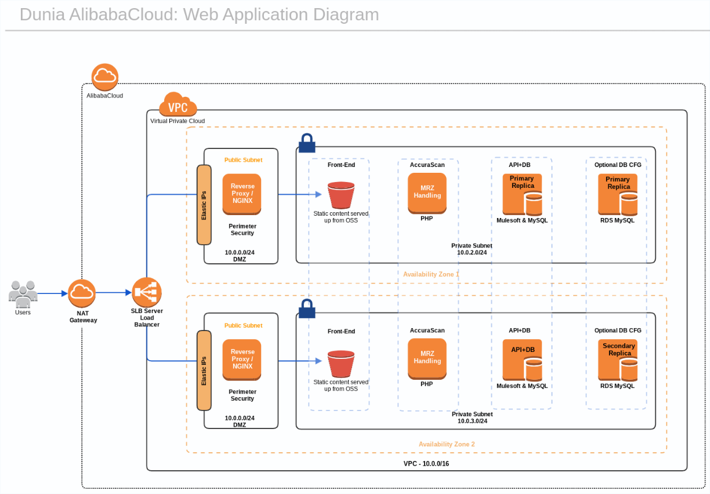
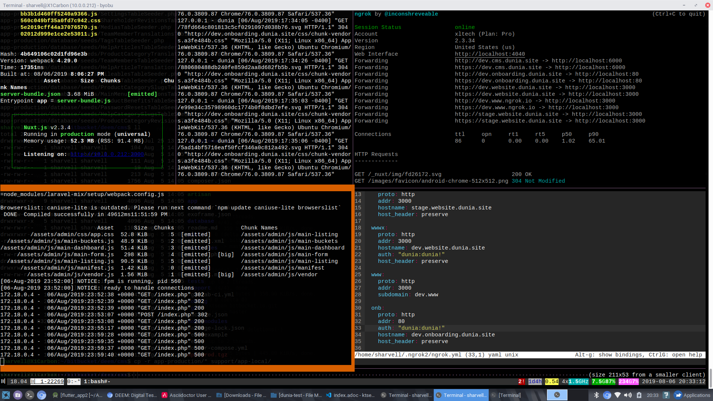
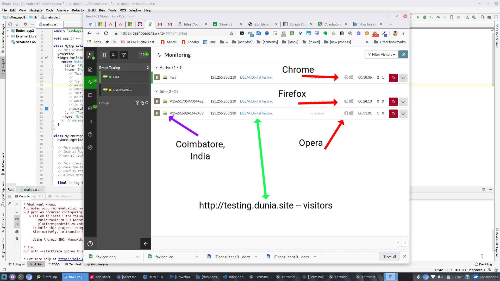
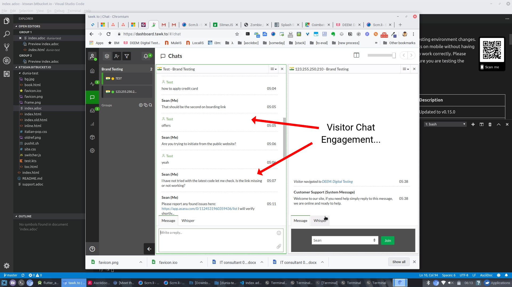
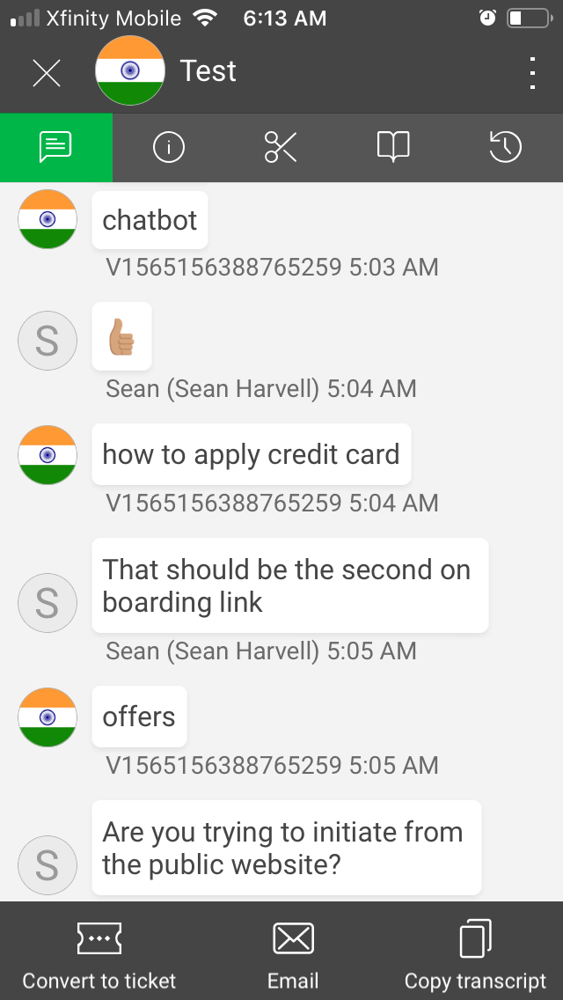
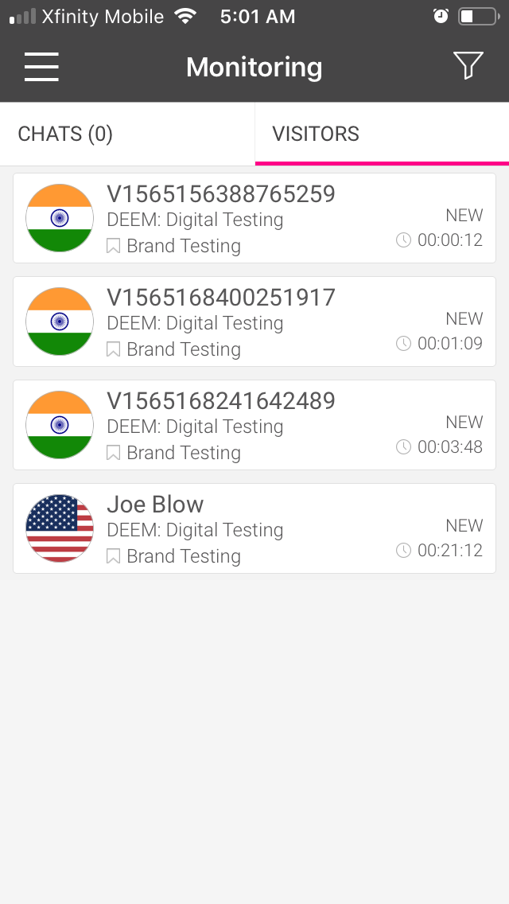
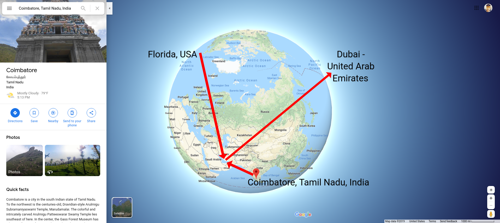
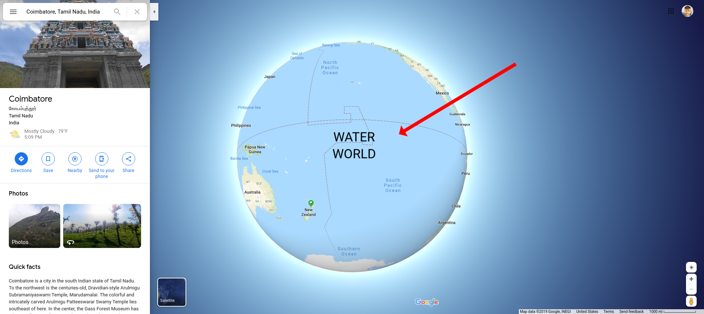

= DEEM: Digital Testing
Digital testing
:icons: font
:toc: left

== Testing

=== SECTION Testing Notes
include::inc_barcode.inc[]

=== Test Links
include::inc_test_links.inc[]

=== Test Related Updates
.Latest Updates
****
include::version.txt[]
****

=== SECTION Additional Test information
include::inc_adtl_info.inc[]

=== Services
[cols="1,3", options="header"] 
.Services
|===
|Name
|Link
|Mule proxy
|http://mule.dunia.site/
|Service utility endpoints
|http://service.dunia.site/
|===

[cols="1,3", options="header"] 
.Utility
|===
|Name
|Link

|Accurascan MRZ/OCR
|http://service.dunia.site/i/ocr-mrzdata-from-uaeid.php
|Testing page
|http://testing.dunia.site/
|Email validation
|http://service.dunia.site/i/emailvalidate.php
|===

== DevOps
=== Reference Architecture
icon:forward[sa] Will update older version with latest container model when complete.

=== Development Environment

== DevOps
=== Reference Architecture
icon:forward[sa] Will update older version with latest container model when complete.

=== Development Environment

== Other
=== Testing Chat
++++

 

++++

=== Monitoring and Chat Screens

== Update Board
++++
<!--Start of nabble Script-->
<a id="nabblelink" href="http://brand-digital-testing.164727.n8.nabble.com/">BRAND DIGITAL TESTING</a>

<!--End of nabble Script-->
++++
'''